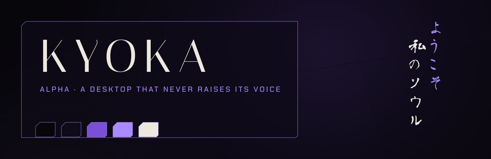

<p align="center"></p>

<p align="center"><sub>ようこそ 私のソウル・ソサエティ</sub></p>

# Kyoka alpha

A desktop that never raises its voice.

Void planes. A violet aura, felt more than seen. Bone type. One accent at a time. The fracture is 14 by 6, and it is drawn only where it can be.

The other Kyoka is [kyoka-delta](https://github.com/houssemMekhelbi/kyoka-delta).

## Palette

| | | |
|---|---|---|
| **Void** | `#07060B` | the ground |
| **Deep Violet** | `#0F0B18` | planes |
| **Violet** | `#7B4FD6` | structure |
| **Pale Violet** | `#A98BFF` | attention |
| **Bone** | `#EDE8DF` | text |

## What it holds

- **Windows**: gaps 6/12, sharp, glass 0.90/0.78, blur 10×3; a 1px border Pale Violet
  → Violet → nothing; the aura on the focused window only
- **Waybar**: one Deep Violet plane in three shards, outer corners cut 14/6
- **mawaqit**: a fractured banner; an outlined shard for the adhan, a cracked one
  for the iqama
- **yawm**: `YAWM ▰ n`; ◆ overdue, ◆ today, ◇ later, ¶ notes
- **hyprlock**: the clock left, the saying in two vertical columns right,
  set in Aoyagi Reisho; no username
- **KyokaShard** cursor, **KyokaAlpha** icons, **GTK / Thunar**, **swaync**
- **Terminals**: Martian Mono at 86% void; tmux; an agnoster-style zsh chain
- **Type**: Italiana, Chakra Petch, Martian Mono, Aoyagi Reisho

## Requirements

- Arch Linux (the package check uses `pacman`)
- Hyprland 0.56 or newer: the configuration is written in Lua
- waybar 0.15 or newer
- the packages in `kyoka-alpha/packages.txt`:

```sh
sudo pacman -S --needed $(grep -v '^#' kyoka-alpha/packages.txt)
```

## Install

> [!WARNING]
> This is a whole desktop, not a colour scheme. It replaces every file listed
> in `kyoka-alpha/MANIFEST`: the Hyprland, waybar, terminal, tmux, GTK and fontconfig
> configuration among them, and the theme line in `~/.zshrc`.
> Everything it replaces is backed up first.

```sh
git clone https://github.com/houssemMekhelbi/kyoka-alpha.git
cd kyoka-alpha
./kyoka-alpha/restore.sh --dry-run   # show what would change, touch nothing
./kyoka-alpha/restore.sh             # apply
```

`restore.sh` then:

1. reports missing packages;
2. backs up every path it is about to replace to `~/themes/.backups/before-kyoka-alpha-<timestamp>/`;
3. copies the theme's `home/` over `$HOME` and removes the paths in its `ABSENT`;
4. points `~/.zshrc` at the theme's prompt;
5. applies its `gsettings.txt` and refreshes the font and icon caches;
6. builds the mawaqit-api image if it is missing, enables the user services and
   reloads Hyprland, waybar, hyprpaper, swaync and tmux.

`--files-only` copies the files and gsettings and leaves the services alone.

## Undo

Copy the backup folder back over `$HOME`.

## Prayer times

Prayer times come from [mawaqit.net](https://mawaqit.net) through a local copy of
[mawaqit-api](https://github.com/mrsofiane/mawaqit-api), run by podman on 127.0.0.1.
List your mosques in `~/.config/mawaqit/mosques`, one `<mawaqit.net slug> | <label>`
per line; scroll or right-click the prayer module to switch between them.

## The others

This is one of the hattin themes. They share one behaviour (binds, workspaces,
bar modules) and differ only in look. Clone several side by side and run the
`restore.sh` of the one you want: each switch removes what the previous theme
left that the new one does not use.

## Licence

MIT, see [LICENSE](LICENSE). The fonts in `<theme>/home/.local/share/fonts/` are
under the SIL Open Font License, except Aoyagi Reisho SIMO, which is free to redistribute together
with its usage and description files (they sit next to it); each licence text sits next to its font.
mawaqit-api (`<theme>/home/.local/share/mawaqit-api/`) is MIT, © Sofiane Louchene.
